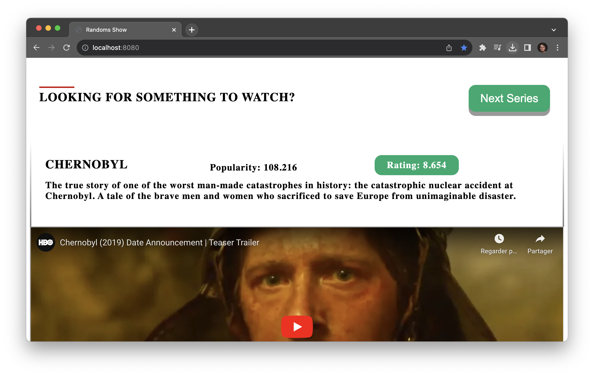

# Random Show Generator



## Overview

Random Show Generator is a simple web application built using Java and Spring Boot that generates random TV shows for users to discover. The application provides an API to fetch random shows and a web interface for a user-friendly experience.

## Table of Contents

- [How It Works](#how-it-works)
- [Technologies Used](#technologies-used)
- [How to Run](#how-to-run)
- [API source](#api-source)
- [Contact](#contact)

## How It Works

The application utilizes a Java Spring Boot backend to serve an API endpoint that returns random TV shows. The frontend is built with HTML and CSS to provide a simple and intuitive user interface.

## Technologies Used

- Java
- Spring Boot
- HTML
- CSS

## How to Run

Follow these steps to run the Random Show Generator locally:

1. **Clone the Repository:**
   ```bash
   git clone https://github.com/your-username/random-show-generator.git
    ```
2. **Run the Application:**

    ```bash
    cd random-show-generator
    ./mvnw spring-boot:run
    ```
3. **Open the Application:**
    
        Open your browser and navigate to `http://localhost:8080/`

## API source 

<!-- themoviedb -->
- [The Movie Database](https://www.themoviedb.org/)
- [The Movie Database API](https://developers.themoviedb.org/3/getting-started/introduction)

## contact
- Linkedin: [JeanMichelBB](https://www.linkedin.com/in/jeanmichelbb/)
- Github: [JeanMichelBB](https://github.com/JeanMichelBB)
- My Website: [jeanmichelbb.github.io](https://jeanmichelbb.github.io/)